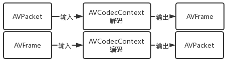

- [demuxing\_decoding 解封装解码](#demuxing_decoding-解封装解码)
- [编译和运行 How to Run](#编译和运行-how-to-run)
  - [构建和编译](#构建和编译)
  - [如何运行](#如何运行)
- [Demuxing解封装](#demuxing解封装)
- [资源的申请和释放](#资源的申请和释放)
  - [资源申请](#资源申请)
  - [释放](#释放)
- [解码](#解码)
- [参考](#参考)

# demuxing_decoding 解封装解码
本例子的功能是把一个视频文件，进行解封装，解码，把解码后的视频数据和音频数据分别写到文件。

整体流程:

解封装-->解码器-->从容器读取AVPacketpacket-->送解码器解码-->从解码器取出AVFrame.


图解核心逻辑请参考：
[ffmpega数据结构及操作图](https://kdocs.cn/l/cp88RyxsqkMM)



图：编解码


图：容器核心数据


图：解码器核心逻辑


图：相关数据结构

# 编译和运行 How to Run
## 构建和编译
[构建编译请点击本链接](https://github.com/iherewaitfor/FFmpegDemos/tree/main/examples#how-to-build-%E5%A6%82%E4%BD%95%E6%9E%84%E5%BB%BA)

## 如何运行

demuxing_decoding.exe  input_file video_output_file audio_output_file

如：
```
demuxing_decoding.exe  D:/a.mp4  a.yuv audio
```

根据传入的视频文件，会有对应的输出，说明如何使用ffplay播放这些解码后的数据。
```
Play the output video file with the command:
ffplay -f rawvideo -pixel_format yuv420p -video_size 1280x720 out.yuv
Play the output audio file with the command:
ffplay -f f32le -ac 1 -ar 44100 audio
```


# Demuxing解封装

 	Demuxers read a media file and split it into chunks of data (packets). A packet contains one or more encoded frames which belongs to a single elementary stream. In the lavf API this process is represented by the avformat_open_input() function for opening a file, av_read_frame() for reading a single packet and finally avformat_close_input(), which does the cleanup.

```C++
int avformat_open_input(AVFormatContext **ps, const char *url,
                        const AVInputFormat *fmt, AVDictionary **options);
```
# 资源的申请和释放
## 资源申请
- AVFormatContext *fmt_ctx
- AVCodecContext *video_dec_ctx
- AVFrame * frame
- AVPacket *pkt
- uint8_t *video_dst_data[4] = {NULL}; //image缓存

申请AVFormatContext
``` c++
    /* open input file, and allocate format context */
    //使用avformat_close_input进行资源释放
    if (avformat_open_input(&fmt_ctx, src_filename, NULL, NULL) < 0) {
```

申请AVCodecContext
```C++
AVCodecContext **dec_ctx;

AVStream *st;
const AVCodec *dec = NULL;

st = fmt_ctx->streams[AVMEDIA_TYPE_VIDEO];
dec = avcodec_find_decoder(st->codecpar->codec_id);
 //avcodec_alloc_context3申请解码器空间， 使用avcodec_free_context进行翻译
*dec_ctx = avcodec_alloc_context3(dec);
avcodec_parameters_to_context(*dec_ctx, st->codecpar);
avcodec_open2(*dec_ctx, dec, NULL) ;  //初始化解码器
```

申请AVFrame
```C++
frame = av_frame_alloc(); //使用av_frame_free释放
//avcodec_receive_frame(dec, frame)  拿到解码后的帧，可以读取到视频帧数据。
```
申请AVPacket
```C++
pkt = av_packet_alloc(); //申请空间
//avcodec_send_packet(dec, pkt);把编码的包送去解码。
//av_packet_unref(): Wipe the packet.Unreference the buffer referenced by the packet and 
//reset the remaining packet fields to their default values.
//av_packet_unref(pkt);  每次用完packet
//av_packet_free(&pkt);释放资源 
```
申请视频帧缓存。根据格式不同，使用的数据不同。如AV_PIX_FMT_YUV420P、AV_PIX_FMT_RGBA.
```C++
int av_image_alloc(uint8_t *pointers[4], int linesizes[4],
                   int w, int h, enum AVPixelFormat pix_fmt, int align);
```

## 释放
```C++
    avcodec_free_context(&video_dec_ctx); // AVCodecContext * 
    avcodec_free_context(&audio_dec_ctx); //AVCodecContext * 
    avformat_close_input(&fmt_ctx);       //AVFormatContext *fmt_ctx
    if (video_dst_file)
        fclose(video_dst_file);
    if (audio_dst_file)
        fclose(audio_dst_file);
    av_packet_free(&pkt);               //AVPacket *
    av_frame_free(&frame);              //AVFrame *
    av_free(video_dst_data[0]);         //uint8_t *video_dst_data[4]
```
# 解码
解码核心逻辑

- 从文件中读出AVPacket
- 把AVPacket送到解码器
- 从解码器取AVFrame
```C++
    /* read frames from the file */
    av_read_frame(fmt_ctx, pkt)

    // submit the packet to the decoder
    avcodec_send_packet(dec, pkt);

    // get the available frame from the decoder
    avcodec_receive_frame(dec, frame)
```

# 参考
[https://ffmpeg.org/doxygen/5.1/index.html](https://ffmpeg.org/doxygen/5.1/index.html)

[https://ffmpeg.org/doxygen/5.1/group__libavf.html](https://ffmpeg.org/doxygen/5.1/group__libavf.html)