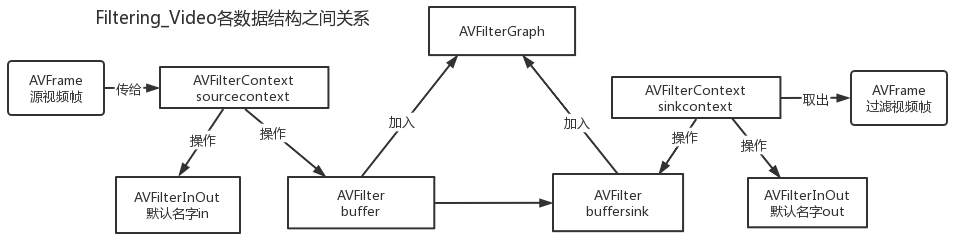

# 过滤视频 filtering_video_sharedmemory
## 过滤器概念

过滤器分三种 filters, sources, and sinks.
- sources 无输入pads，有输出
- filters 有输入输出pads。
- sinks   有输入pads，无输出

```
                [main]
input --> split ---------------------> overlay --> output
            |                             ^
            |[tmp]                  [flip]|
            +-----> crop --> vflip -------+
```

过滤器图字符描述示例
```
ffmpeg -i INPUT -vf "split [main][tmp]; [tmp] crop=iw:ih/2:0:0, vflip [flip]; [main][flip] overlay=0:H/2" OUTPUT
```
过滤器图实体及语法
- 讲解示例
  ```
    scale=640:360,split [main][tmp]; [tmp] crop=iw:ih/2:0:0, vflip [flip]; [main][flip] overlay=0:H/2
  ```
- 过滤器
  - 语法为：名字加=，后面加参数，如scale=640:360
  - 如果有参数
    - 多个参数使用冒号隔开
    - 如scale=640:360。视频帧宽拉伸到640，高度拉伸到360
  - 过滤器的输入输出使用实体[LINKLABEL]表示。其为视频帧缓存。
    - [LINKLABEL]，如上例中的[main]、[temp]
    - 一个过滤器可以有多个输入和输出。如上例。
  - 没给出输入LINKLABEL的过滤器，其默认输入LINKLABEL为[in]
  - 没给出输出LINKLABEL的过滤器，其默认输出LINKLABEL为[out]
- 过滤链
  - 一个或多个过滤器组成一条过滤链
  - 使用逗号隔开过滤器
- 过滤图
  - 一个或多个过滤链链组成过滤图
  - 使用分号隔开过滤链

过滤器的语法描述 
```
AME              ::= sequence of alphanumeric characters and '_'
FILTER_NAME      ::= NAME["@"NAME]
LINKLABEL        ::= "[" NAME "]"
LINKLABELS       ::= LINKLABEL [LINKLABELS]
FILTER_ARGUMENTS ::= sequence of chars (possibly quoted)
FILTER           ::= [LINKLABELS] FILTER_NAME ["=" FILTER_ARGUMENTS] [LINKLABELS]
FILTERCHAIN      ::= FILTER [,FILTERCHAIN]
FILTERGRAPH      ::= [sws_flags=flags;] FILTERCHAIN [;FILTERGRAPH]
```
# 编译和运行
## 构建编译 请参考
[demuxing_decoding的构建和编译](https://github.com/iherewaitfor/FFmpegDemos/blob/main/examples/demuxing_decoding/README.md#%E7%BC%96%E8%AF%91%E5%92%8C%E8%BF%90%E8%A1%8C-how-to-run)
## 运行
首先运行过滤视频
```
    filtering_video_sharedmemory.exe D:/guilinvideo.mp4
```

然后运行渲染程序，从共享内存中读出过滤后的视频帧数据进行渲染。
[https://github.com/iherewaitfor/direct3d11demo/tree/main/ShareTextureRGBAFFmpeg/CreateShareTexture](https://github.com/iherewaitfor/direct3d11demo/tree/main/ShareTextureRGBAFFmpeg/CreateShareTexture)

编译该程序后，使用以下命令：

Demo.exe 共享内存名字 视频宽度 视频高度

```
Demo.exe myShareMemRGBA456 640 360
```
即可以看到视频过滤后的效果了。

直接运行
# 过滤器各数据结构之间关系

# 过滤器图AVFilterGraph
创建对象
```C++
    avfilter_graph_alloc();
```
过滤图初始化、校验配置是否有效。
```C++
    avfilter_graph_parse_ptr(filter_graph, filters_descr,
                                    &inputs, &outputs, NULL))

    avfilter_graph_config(filter_graph, NULL)
```

释放对象
```C=+
    avfilter_graph_free(&filter_graph);
```
# 过滤器AVFilter及上下文AVFilterContext
## 过滤器的获取及初始化
申请source过滤器和sink过滤器。
```C++
    const AVFilter *buffersrc  = avfilter_get_by_name("buffer");
    const AVFilter *buffersink = avfilter_get_by_name("buffersink");
```

构建参数，创建AVFilterContext。包括source和sink

```C++
    /* buffer video source: the decoded frames from the decoder will be inserted here. */
    snprintf(args, sizeof(args),
            "video_size=%dx%d:pix_fmt=%d:time_base=%d/%d:pixel_aspect=%d/%d",
            dec_ctx->width, dec_ctx->height, dec_ctx->pix_fmt,
            time_base.num, time_base.den,
            dec_ctx->sample_aspect_ratio.num, dec_ctx->sample_aspect_ratio.den);
    avfilter_graph_create_filter(&buffersrc_ctx, buffersrc, "in", args, NULL, filter_graph);
    avfilter_graph_create_filter(&buffersink_ctx, buffersink, "out",
                                       NULL, NULL, filter_graph);
```
设置上下文参数
```C++
    enum AVPixelFormat pix_fmts[] = { AV_PIX_FMT_RGBA, AV_PIX_FMT_NONE };
    av_opt_set_int_list(buffersink_ctx, "pix_fmts", pix_fmts,
                                AV_PIX_FMT_NONE, AV_OPT_SEARCH_CHILDREN);
```
## 过滤操作
把解码后的AVFrame送入过滤图的入口过滤器source
```C++
    /* push the decoded frame into the filtergraph */
    av_buffersrc_add_frame_flags(buffersrc_ctx, frame, AV_BUFFERSRC_FLAG_KEEP_REF)
```
从过滤图的出口过滤器sink中取得过滤后的AVFrame
```c++
    /* pull filtered frames from the filtergraph */
    av_buffersink_get_frame(buffersink_ctx, filt_frame)
```


# 参考
[https://ffmpeg.org/ffmpeg-filters.html](https://ffmpeg.org/ffmpeg-filters.html)