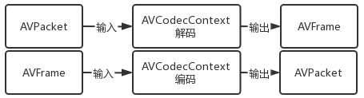
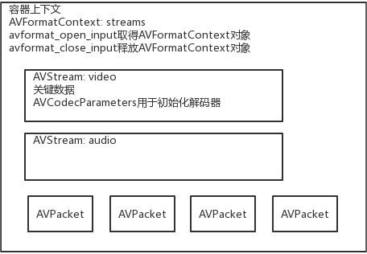
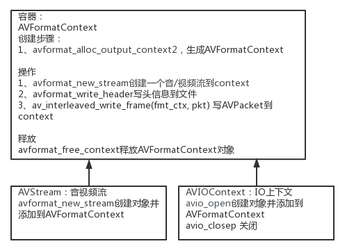
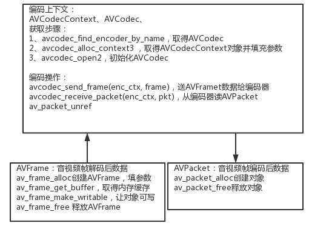
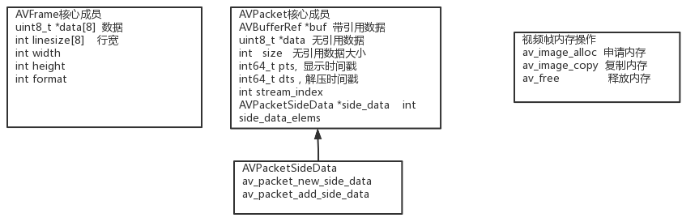

# 封装及编码muxing and encoding
本例子的功能是讲解如何 封装及编码 并输出文件。其中的视频数据和音频数据为程序生成。实际应用中，一般从设备采集视频帧和音频帧源数据。

整体流程:

生成容器-->生成编码器-->生成AVFrame并填充数据-->送编码器编码-->取出编码后的AVPacket-->填充到容器.


图解核心逻辑请参考：
[ffmpega数据结构及操作图](https://kdocs.cn/l/cp88RyxsqkMM)



图：编解码



图：容器核心数据




图：容器操作



图：编码器核心逻辑



图：相关数据结构

# 编译及运行
## 构建编译 请参考
[demuxing_decoding的构建和编译](https://github.com/iherewaitfor/FFmpegDemos/blob/main/examples/demuxing_decoding/README.md#%E7%BC%96%E8%AF%91%E5%92%8C%E8%BF%90%E8%A1%8C-how-to-run)

## 运行
muxing.exe outputfile
```
muxing.exe data.mp4
```
生成的data.mp4可以直接用播放器播放。该文件包括音频流和视频流。
# 


